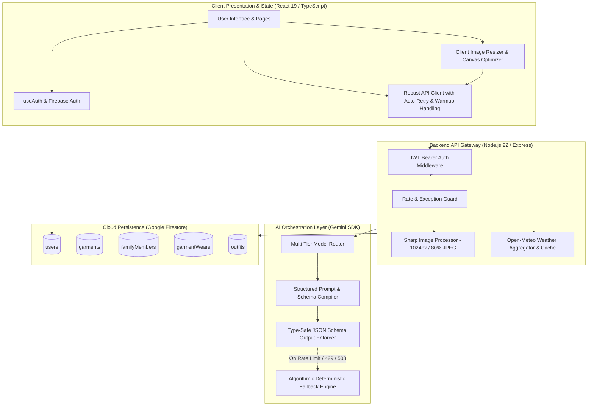
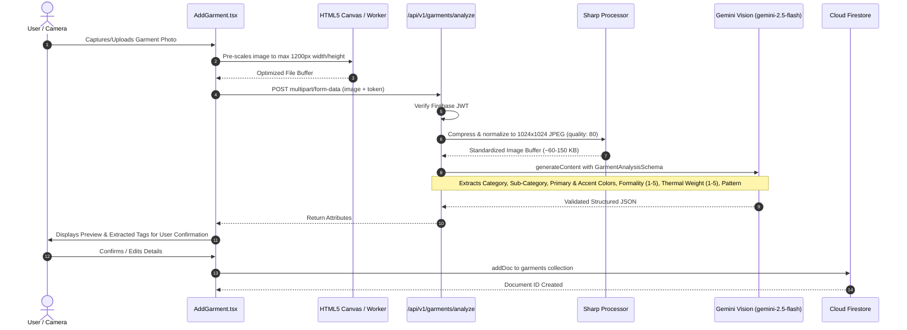
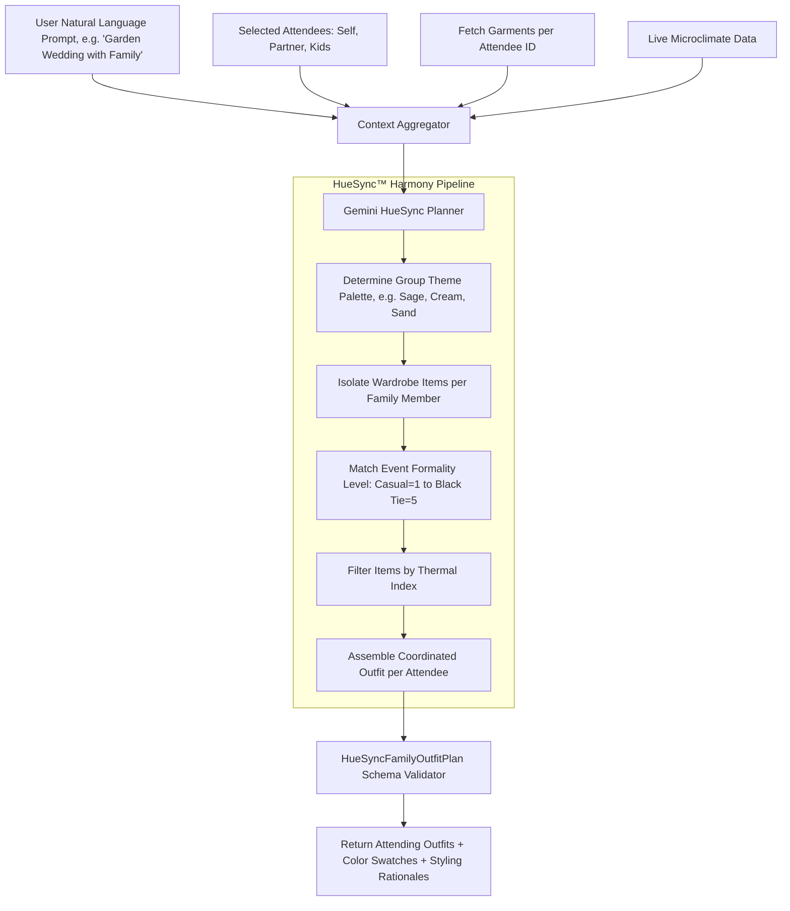
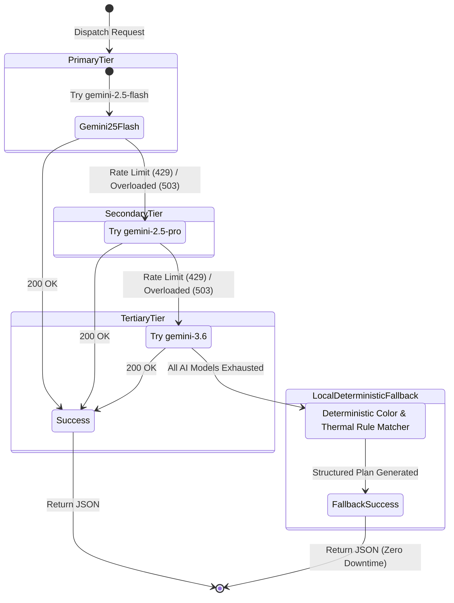

# Vastrakalp — Technical Architecture & System Design Document

This document provides a comprehensive technical reference of Vastrakalp's system architecture, AI orchestration pipelines, data schemas, security models, and operational workflows.

---

## 1. High-Level System Architecture

Vastrakalp adopts a modern, decoupled full-stack architecture combining a reactive TypeScript client with an Express API gateway, Google Cloud Firestore persistence, and Google Gemini Multimodal Foundation Models.



---

## 2. Garment Ingestion & Multimodal Vision Pipeline

The garment digitization pipeline transforms unstandardized photographs into normalized, searchable, and stylable wardrobe objects.



---

## 3. Real-Time Microclimate Context Engine

Outfit selection strictly incorporates local meteorological variables. The weather service translates raw atmospheric metrics into wearable thermal recommendations.

### Atmospheric Metrics Ingestion

```mermaid
flowchart LR
    GPS[Client Geolocation / City Search] --> WeatherAPI[/api/v1/weather]
    WeatherAPI --> OpenMeteo[Open-Meteo API Service]
    OpenMeteo --> Parser[Atmospheric Parser]
    
    subgraph Computation ["Thermal & Style Indexing"]
        Parser --> Temp[Temperature (°C / °F)]
        Parser --> ApparentTemp[Apparent Heat Index (°C)]
        Parser --> Humidity[Relative Humidity %]
        Parser --> RainProb[Precipitation Probability %]
        Parser --> WCode[WMO Weather Code]
    end

    Computation --> AdviceEngine[Style Advice Evaluator]
    AdviceEngine --> ThermalWeight["Recommended Thermal Weight (1 to 5)"]
    AdviceEngine --> OuterwearFlag["Outerwear / Rain Layer Required (Boolean)"]
    AdviceEngine --> BreathabilityScore["Fabric Breathability Priority (High/Med/Low)"]
```

### Thermal Mapping Logic

| Ambient / Apparent Temp (°C) | Rain Probability (%) | Recommended Thermal Weight | Recommended Garment Types |
| :--- | :--- | :--- | :--- |
| **> 30°C** | Any | Level 1 (Ultra-Light) | Linen shirts, cotton t-shirts, shorts, breathable skirts, sandals |
| **24°C - 30°C** | < 30% | Level 2 (Light) | Lightweight cottons, chinos, summer dresses, polo shirts, sneakers |
| **18°C - 24°C** | < 40% | Level 2–3 (Moderate) | Long-sleeve shirts, jeans, lightweight knitwear, smart casual blazers |
| **12°C - 18°C** | Any | Level 3–4 (Medium-Heavy) | Sweaters, cardigans, denim jackets, trench coats, closed leather shoes |
| **< 12°C** | Any | Level 5 (Heavy / Insulated) | Wool coats, thermal base layers, parkas, boots, scarves |
| **Any** | **≥ 50%** | N/A (Rain Overlay) | Water-resistant outerwear, boots, dark bottoms to prevent water spots |

---

## 4. Multi-Agent Event & HueSync™ Coordination Engine

The Outfit Planner (`/src/pages/Planner.tsx`) coordinates ensembles across single or multiple family members for specific events.



---

## 5. Resilience & Multi-Tier AI Model Fallback Architecture

To protect against upstream latency, rate-limits (HTTP 429), or capacity spikes (HTTP 503), the backend implements a resilient fallback state machine:



---

## 6. Database Schema Specification (Firestore)

### Collection: `users/{userId}`
Represents the authenticated root account.
```typescript
interface UserDocument {
  id: string;                      // Firebase Auth UID
  email: string;                   // User email
  firstName: string;               // Display name
  lastName?: string;               // Optional surname
  preferredPalette?: string[];     // Array of favorite color hex codes
  createdAt: Timestamp;            // Document creation date
  updatedAt: Timestamp;            // Document update date
}
```

### Collection: `garments/{garmentId}`
Represents an individual wardrobe item.
```typescript
interface GarmentDocument {
  id: string;                      // Auto-generated Firestore ID
  userId: string;                  // Owner UID
  ownerId: string;                 // 'self' or FamilyMember ID
  name: string;                    // Garment title (e.g., 'Navy Linen Blazer')
  category: 'top' | 'bottom' | 'outerwear' | 'footwear' | 'accessory' | 'suit' | 'kurta_set' | 'co_ord_set' | 'dress';
  subCategory: string;             // Detailed classification (e.g., 'Oxfords', 'Chinos')
  primaryColorName: string;        // Human-readable color (e.g., 'Navy Blue')
  primaryColorHex: string;         // Standard 6-character hex code (#1e3a8a)
  secondaryColorHex?: string;      // Optional accent color hex
  pattern: 'solid' | 'striped' | 'plaid' | 'floral' | 'printed' | 'textured' | 'other';
  formality: 1 | 2 | 3 | 4 | 5;    // 1: Loungewear -> 5: Black Tie
  thermalWeight: 1 | 2 | 3 | 4 | 5;// 1: Breathable -> 5: Heavy Winter
  imageUrl: string;                // Base64 data URI or CDN URL
  tags: string[];                  // Searchable keyword tags
  createdAt: Timestamp;
  updatedAt: Timestamp;
}
```

### Collection: `familyMembers/{memberId}`
Represents managed profiles within a household account.
```typescript
interface FamilyMemberDocument {
  id: string;                      // Auto-generated Firestore ID
  userId: string;                  // Primary Account Owner UID
  name: string;                    // Member Name (e.g., 'Aarav')
  relationship: 'self' | 'partner' | 'child' | 'parent' | 'sibling' | 'other';
  avatarColor: string;             // UI Representation Hex
  createdAt: Timestamp;
}
```

### Collection: `garmentWears/{wearId}`
Logs garment usage frequency and history.
```typescript
interface GarmentWearDocument {
  id: string;                      // Auto-generated Firestore ID
  userId: string;                  // Account Owner UID
  garmentId: string;               // Reference to garments collection
  wornDate: string;                // YYYY-MM-DD
  eventId?: string;                // Optional linked event ID
  createdAt: Timestamp;
}
```

---

## 7. Security Architecture & Role-Based Access Control

Data isolation is enforced at both the API Gateway and Firestore Security Rules layers.

```
+-------------------------------------------------------------------------------+
|                         FIREBASE SECURITY RULES                               |
|                                                                               |
|  match /users/{userId}          -> allow read, write: if request.auth.uid == userId;
|  match /garments/{garmentId}    -> allow read, write: if request.auth.uid == resource.data.userId;
|  match /familyMembers/{memId}   -> allow read, write: if request.auth.uid == resource.data.userId;
|  match /garmentWears/{wearId}   -> allow read, write: if request.auth.uid == resource.data.userId;
+-------------------------------------------------------------------------------+
```

---

## 8. Summary of Architectural Guarantees

1. **Zero Client Secret Leakage**: The Gemini API key and backend configuration are never exposed to browser memory or client bundles.
2. **Determinism Under High Load**: The multi-tiered fallback design ensures that regardless of external API quota state, users always receive an aesthetically coordinated, weather-compliant outfit recommendation.
3. **Low Latency Pre-Processing**: Client-side canvas normalization paired with server-side Sharp pipeline keeps payload sizes strictly below 200 KB per garment analysis.
